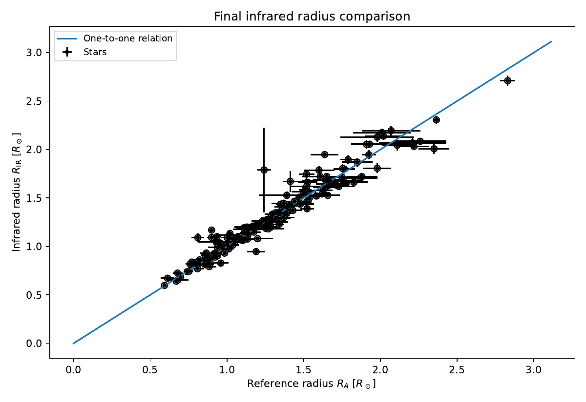
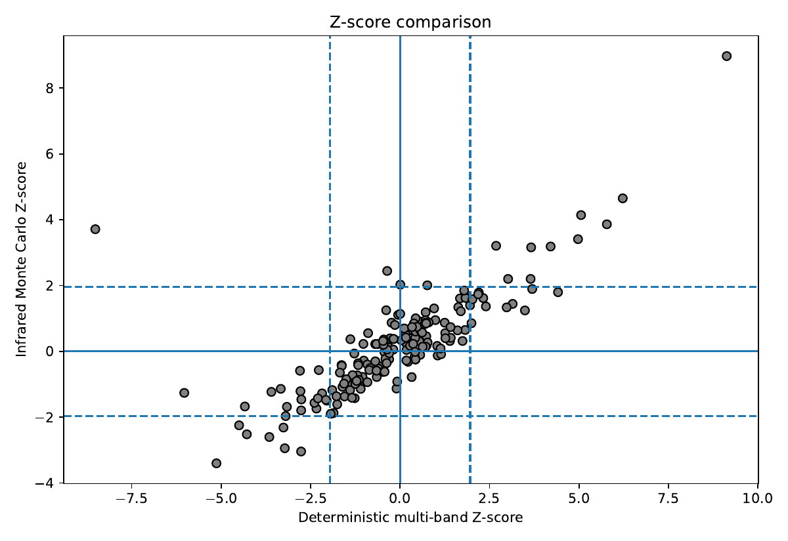
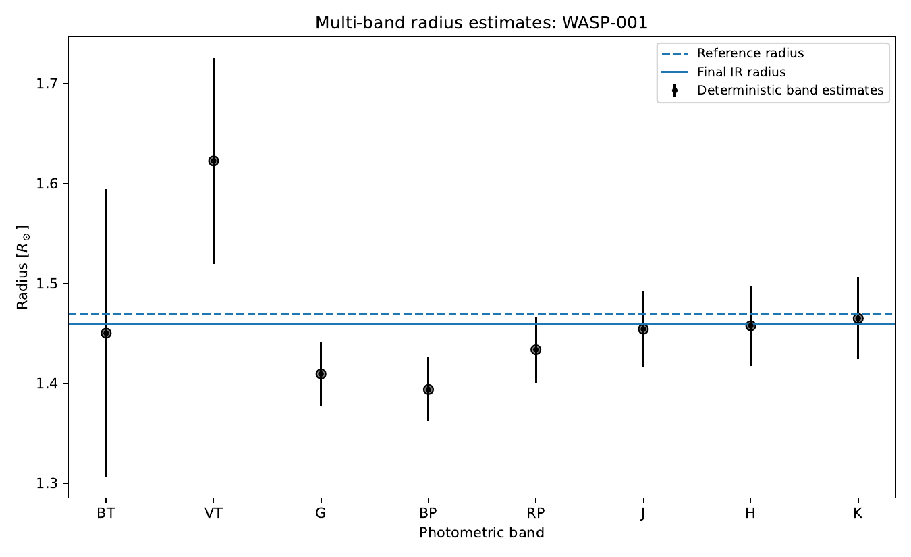

# Stellar Radius Estimation

A numerical pipeline for estimating stellar radii from multi-band photometry, Gaia parallaxes, and bolometric corrections. The framework combines deterministic calculations with Monte Carlo uncertainty propagation to derive robust infrared-based radius estimates and to evaluate their statistical consistency against independent reference measurements.

<p align="center">
  
</p>

<sub><b>Validation.</b> Final infrared radii $R_{\mathrm{IR}}$ against
independent reference measurements $R_A$, with propagated uncertainties on both
axes and the one-to-one relation. Agreement holds across the full range
$0.5$–$3\,R_\odot$; the visible outliers are the ones the pipeline flags
automatically.</sub>

<p align="center">
  
  
</p>

<sub><b>Left:</b> distribution of the z-scores used to test consistency with
the reference catalogue. <b>Right:</b> per-band radius estimates for a single
star (WASP-001), showing how the J, H and K measurements are combined into the
final value.</sub>

---

## Scientific Motivation

Precise stellar radii are essential for exoplanet characterization, stellar evolution studies, and Galactic population analyses. Because planetary radii scale directly with the radius of the host star, systematic errors in stellar parameters propagate into all derived exoplanet properties.

This project provides a fully reproducible framework that integrates broadband photometry, astrometric distances, effective temperatures, and bolometric corrections within a statistically rigorous uncertainty quantification scheme. The pipeline produces validated radius estimates, diagnostic statistics, and publication-quality visualizations suitable for scientific analysis.

---

## Input Data

The pipeline reads the stellar catalogue from `Data/Data.csv`, containing multi-band photometry, Gaia parallaxes, effective temperatures, and external reference radii. Precomputed bolometric-correction samples are provided by `Data/output.file.all` and are used to propagate model uncertainties in the infrared Monte Carlo analysis.

---

## Objectives

The main goals of the project are to:

1. Compute stellar radii independently in multiple photometric bands.
2. Propagate observational uncertainties using Monte Carlo sampling.
3. Combine infrared estimates (J, H, K) into a robust final radius.
4. Compare estimated radii with external reference measurements.
5. Quantify agreement through formal hypothesis testing.
6. Identify and export statistically significant outliers.
7. Produce publication-quality tables and diagnostic plots.

---

## Physical Framework

The radius is derived from the relation between bolometric luminosity and effective temperature.

### Distance from Parallax
$$
d[\mathrm{pc}] = \frac{1}{\varpi[\mathrm{arcsec}]}
$$
### Absolute Bolometric Magnitude
$$
M_{\mathrm{bol}} = m + BC - 5\log_{10}(d) + 5
$$
### Stellar Radius

$$
\frac{R}{R_\odot}=\left(\frac{T_\odot}{T_{\mathrm{eff}}}\right)^2 10^{\frac{M_{\mathrm{bol},\odot}-M_{\mathrm{bol}}}{5}}
$$

where:

* $$(T_\odot = 5771.8\ \mathrm{K})$$
* $$(M_{\mathrm{bol},\odot} = 4.75)$$

---

## Methodology

### 1. Deterministic Multi-band Analysis

Independent radius estimates are computed using eight photometric bands:

* BT
* VT
* G
* BP
* RP
* J
* H
* K

For each band, the pipeline:

1. Computes the stellar distance from Gaia parallax.
2. Derives the apparent and absolute bolometric magnitudes.
3. Calculates the stellar radius.
4. Propagates uncertainties analytically using first-order error propagation.

The resulting radii are combined through inverse-variance weighting to obtain a diagnostic estimate: $$R_{\mathrm{all,det}}$$. This estimate is used for internal consistency checks but is not considered the final result because the individual band estimates are statistically correlated through shared uncertainties in parallax and effective temperature.

---

### 2. Infrared Monte Carlo Analysis

The final radius estimate is derived from the infrared bands:

* J
* H
* K

For each star:

* 10,000 Monte Carlo realizations are generated.
* Parallax and photometric measurements are sampled from Gaussian distributions.
* Precomputed bolometric correction samples are read from an external file.
* Radii are computed independently in J, H, and K.
* Non-physical samples are discarded.
* All valid JHK samples are merged into a single posterior-like distribution.

The final estimate is defined as:

* **Mean** of the combined distribution → `R_IR`
* **Standard deviation** → `e_R_IR`
* **Median and 16th/84th percentiles** for robustness diagnostics

This approach provides a statistically rigorous estimate that naturally incorporates observational and model uncertainties.

---

## Statistical Validation

The estimated radius is compared with an external reference radius ($$R_A$$) using a Z-score:

$$
Z = \frac{R_{\mathrm{IR}} - R_A}{\sqrt{\sigma_{\mathrm{IR}}^2 + \sigma_A^2}}
$$

A result is considered statistically consistent when:

$$
|Z| < 1.96
$$

corresponding to a two-sided 95% confidence interval under Gaussian assumptions.

---

## Example Validation Results

Using a catalogue of 180 stars, the pipeline achieved:

  | Metric | Value |
  |--------|:------:|
  | Analysed stars | 180 |
  | Deterministic multi-band success rate | 74.44% |
  | Infrared Monte Carlo success rate | 87.78% |
  | Median $$Z_{all_{det}}$$ | 1.141 |
  | Median $$Z_{IR}$$ | 0.840 |
  | Outliers after infrared analysis | 22 |

These results demonstrate that the infrared Monte Carlo approach substantially improves agreement with independent reference radii.

---

## Output Products

### Final Catalogue

* `Results/Radius.csv`

Contains:

* deterministic radius estimates,
* infrared Monte Carlo results,
* confidence intervals,
* Z-scores,
* residuals,
* relative parallax uncertainties.

### Outlier Catalogue

* `Results/Radius_outliers.csv`

Contains all stars with $$|Z_{\mathrm{IR}}| \ge 1.96$$ along with detailed diagnostic information.

---

## Diagnostic Plots

### Global Diagnostics

* **Infrared Radius vs Reference Radius** (`Plots/Final_R_IR_vs_R_A.pdf`)
  Direct comparison between `R_IR` and `R_A`.

* **Residual Analysis** (`Plots/Residuals_R_A_minus_R_IR.pdf`)
  Residuals $$(R_A - R_{\mathrm{IR}})$$ with failed Z-tests highlighted.

* **Z-score Comparison** (`Plots/Z_score_comparison.pdf`)
  Comparison between deterministic and infrared statistical consistency.

* **Relative Uncertainty Comparison** (`Plots/Relative_radius_errors.pdf`)
  Comparison of fractional uncertainties.

### Star-specific Diagnostics

For a selected star:

* **Multi-band Radius Estimates** (`Plots/<ID>_multiband_radius.pdf`)
  Radii from all available bands together with final and reference values.

* **Infrared Monte Carlo Distribution** (`Plots/<ID>_IR_distribution.pdf`)
  Histogram of the combined JHK radius distribution.

---

## Interactive Analysis

At the end of the execution, the program prompts the user to select a catalogue index:

```python
"Insert star index for detailed diagnostics: "
```

The pipeline then:

1. Prints a detailed summary of all radius estimates.
2. Reports statistical agreement with the reference value.
3. Generates star-specific diagnostic plots.

